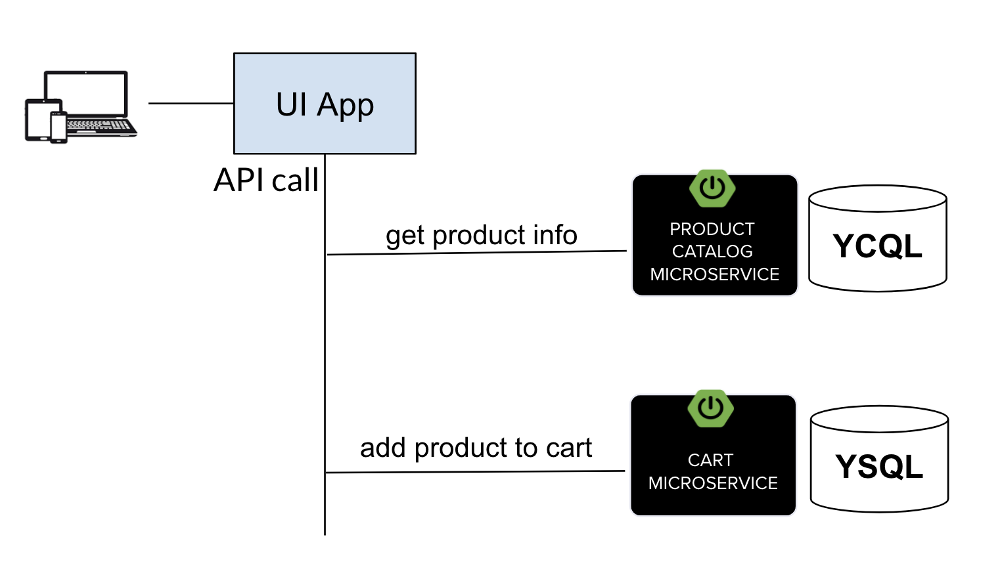

# Spring Developer Workshop for YugabyteDB and VMware Tanzu Kubernetes Grid (TKG)

This workshop will provide developers with hands on experience in building Spring Boot applications 
with YugabyteDB database. In this session we'll be implementing a Retail catalog lookup application 
use-case which is a low-latency, resilient and HA lookup web-service. This is a hands-on session 
where developers will incrementally develop Product catalog and Checkout microservice using YugabyteDB 
as a backing transactional database. Session includes presentations and hands-on labs.

## Retail Catalog Lookup application

 Microservice         | YugabyteDB API | Spring Projects | Description           |
| -------------------- | ---------------- | ---------------- | --------------------- |
| [Product Catalog](https://github.com/yugabyte/spring-tanzu-workshop/tree/master/product-catalog-microservice) | YCQL | Spring Web, Spring Data Cassandra | This microservice serves the product catalog information. It uses Spring Data Cassandra repositories for querying the product catalog information stored in YugabyteDB YCQL Table.
| [Checkout](https://github.com/yugabyte/spring-tanzu-workshop/tree/master/checkout-microservice) | YCQL | Spring Web, Spring Data JPA | This microservice handles the product checkout functionality. It uses Spring Data JPA repositories for transactional commit into YugabyteDB YSQL Tables.

## Agenda

- YugabyteDB Fundamentals

- Deploying YugabyteDB on Tanzu Kubernetes Grid (TKG)

- Implementing Product Catalog Microservice using Yugabyte CQL API (NOSQL)

- Implementing Checkout Microservice using Yugabyte SQL API (RDBMS)

- Putting it all together on TKG

## Prerequisites

- Basic understanding of Spring Data and Spring Boot
- Basical familiarity 
- Familiarity with running basic Linux commands from a command prompt
- IDE of choice

## Technical Requirements

- Java 1.8 installed
- GitHub account
- Maven installed
- Docker desktop installed
- Internet access - ability to access sites via port 80 and 443 (HTTPS)

